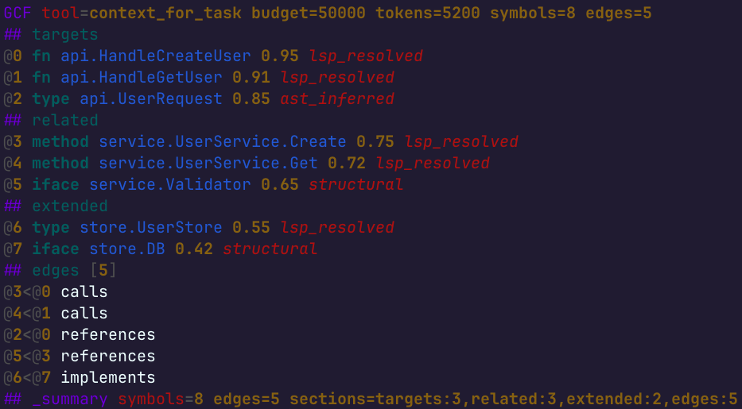

<p align="center">
  <a href="https://github.com/blackwell-systems"></a>
  <a href="LICENSE"></a>
</p>

# tree-sitter-gcf

Tree-sitter grammar for [GCF](https://gcformat.com/), the token-optimized wire format for LLMs.

Enables syntax highlighting in Neovim, Helix, Zed, Emacs, and any editor that supports tree-sitter.



## Supported syntax

- Header lines (`GCF tool=... symbols=... edges=...`)
- Section headers (`## targets`, `## edges [N]`, `## name [N]{fields}`)
- Symbol lines (`@0 fn pkg.Auth 0.78 lsp_resolved`)
- Edge lines (`@0<@1 calls`)
- Bare references (`@0  # previously transmitted`)
- Key-value pairs (`key=value`)
- Inline arrays (`tags[3]: read,write,admin`)
- Tabular rows (`Alice|Engineering|95000`)
- Nested fields (`.customer`)
- Summary trailers (`## _summary symbols=3 edges=2`)
- Comments (`# text`)

## Neovim

Add to your tree-sitter config:

```lua
local parser_config = require("nvim-treesitter.parsers").get_parser_configs()
parser_config.gcf = {
  install_info = {
    url = "https://github.com/blackwell-systems/tree-sitter-gcf",
    files = { "src/parser.c" },
    branch = "main",
  },
  filetype = "gcf",
}
```

Then `:TSInstall gcf`.

Copy `queries/highlights.scm` to `~/.config/nvim/queries/gcf/highlights.scm`.

## Helix

Add to `languages.toml`:

```toml
[[language]]
name = "gcf"
scope = "source.gcf"
file-types = ["gcf"]
roots = []

[language.auto-pairs]

[[grammar]]
name = "gcf"
source = { git = "https://github.com/blackwell-systems/tree-sitter-gcf", rev = "main" }
```

Then `hx --grammar fetch && hx --grammar build`.

## Development

```bash
npm install
tree-sitter generate
tree-sitter parse test.gcf
tree-sitter highlight test.gcf
```

## License

MIT
